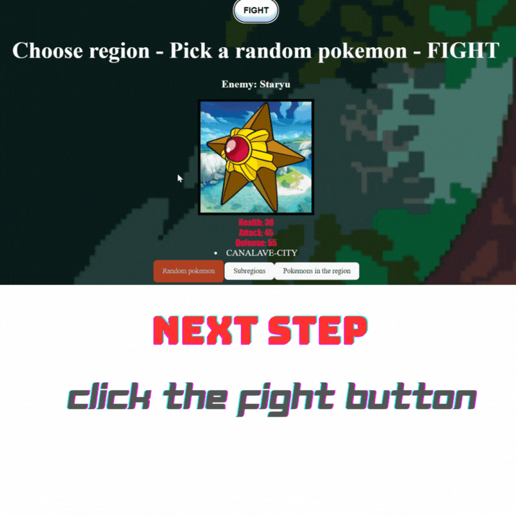

<!-- PROJECT LOGO -->
 

  

<h3 align="center">Fetch them all - Collect pokemons</h3>

  

  In a collaborative duo project, we co-developed a game that leverages an external API to
  fetch data on various Pokémons. Using React, we crafted an interactive platform where
  players can choose their Pokémon, engage in battles with others, and collect any
  Pokémon they defeat. This project involved dynamically integrating external data into
  our application, ensuring a smooth user experience and interactive gameplay.
     
    <a href="https://github.com/CodecoolGlobal/gotta-fetch-em-all-react-Intcognito"><strong>Frontend with React »</strong></a>
     
  

<!-- TABLE OF CONTENTS -->

  
Table of Contents

  <ol>
    <li>
      <a href="#about-the-project">About The Project</a>
      <ul>
        <li><a href="#built-with">Built With</a></li>
      </ul>
    </li>
    <li>
      <a href="#getting-started">Getting Started</a>
      <ul>
        <li><a href="#prerequisites">Prerequisites</a></li>
      </ul>
    </li>
    <li><a href="#contact">Contact</a></li>
  </ol>

<!-- ABOUT THE PROJECT -->
## About The Project

In a collaborative duo project, we co-developed a game that leverages an external API to fetch data on various Pokémons. Using React, we crafted an interactive platform where players can choose their Pokémon, engage in battles with others, and collect any Pokémon they defeat. This project involved dynamically integrating external data into our application, ensuring a smooth user experience and interactive gameplay.
This project demonstrates our ability to integrate external data sources into a web application, creating an engaging and interactive platform for users. Through collaboration and the use of modern technologies, we have delivered a unique and enjoyable gaming experience.
  <h3>Key Features</h3>
  <ul>
   <li><strong>Interactive Gameplay:</strong></li>
      Players can select their Pokémon, battle with others, and collect defeated Pokémon.
     
     
    <li><strong>External API Integration:</strong></li>
      Utilized to fetch and display data on various Pokémons, making the game content-rich and dynamic.
     
     
    <li><strong>Dynamic Data Handling:</strong></li>
      Ensures smooth integration of external data into the game for an immersive experience.
     
     
    <li><strong>Responsive Design:</strong></li>
      Developed the user interface and game logic, providing an engaging and interactive experience for the players.
     
     

  

(<a href="#readme-top">back to top</a>)

### Built With

* [![React][React.js]][React-url]

(<a href="#readme-top">back to top</a>)

<!-- GETTING STARTED -->
## Getting Started

### Prerequisites

### General 
- Node.js
- npm

### Setup Instructions
1. **Clone the Repository**
2. **Navigate to the Project Directory**
3. **Install Dependencies:**
- npm install
4. **Start the Development project**
- npm run dev

After completing these steps, your project should be running on a specified port, commonly http://localhost:3000.

 

(<a href="#readme-top">back to top</a>)

<!-- USAGE EXAMPLES -->
## Usage

**Capture pokemons**

1. <strong>Starter page - Choose location and a random enemy</strong>
   
     
     
    
 
 

2. <strong>If you found a suitable enemy. - Click the FIGHT button</strong>
    
     
    

3. <strong>Select your warrior and click on it.</strong>
     
     
    

4. <strong>The auto-battle starts immediately and if you succeed, you'll catch the defeated pokemon</strong>
     
     
    

5. <strong>Check out your new teammate</strong>
     
     
       

(<a href="#readme-top">back to top</a>)

<!-- CONTACT -->
## Contact

Gömöri Dávid - gomori.david@gmail.com
   
Miskei Máté - miskei.mate@gmail.com
   

Project Link: https://github.com/CodecoolGlobal/gotta-fetch-em-all-react-Intcognito

(<a href="#readme-top">back to top</a>)

<!-- MARKDOWN LINKS & IMAGES -->

[React.js]: https://img.shields.io/badge/React-20232A?style=for-the-badge&logo=react&logoColor=61DAFB
[React-url]: https://reactjs.org/

